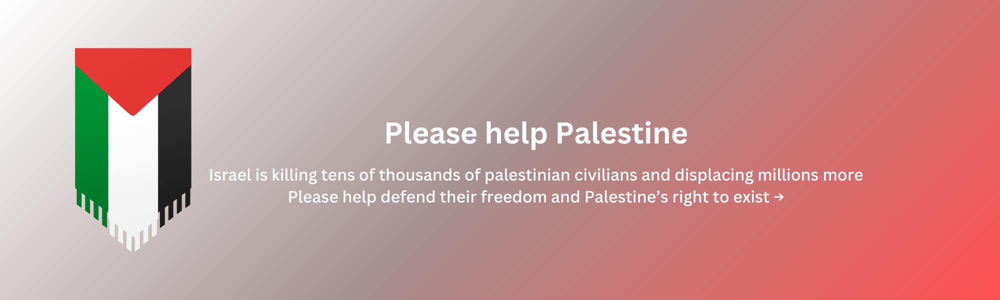
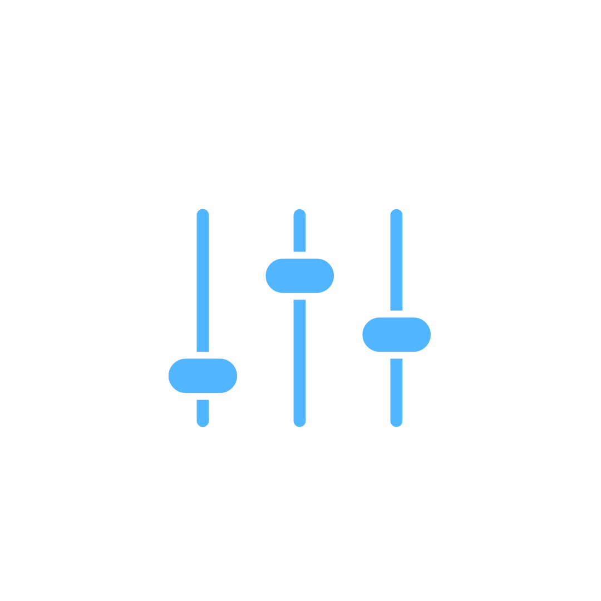

  

  
  <h1>envio</h1>

  <h2 align="center">A Modern And Secure CLI Tool For Managing Environment Variables</h2>

  
  
  

  

To see the GPG encryption demo go <a href="https://github.com/envio-cli/envio/blob/main/assets/envio-gpg-final.gif">here</a>

## About

`envio` is an open source CLI tool that helps make managing environment variables a breeze. With `envio`, users can create encrypted profiles that contain a collection of environment variables associated with a specific project or use case. `envio` ensures security and simplifies the development process by allowing users to easily switch between profiles as needed and load them in their current terminal session for immediate use.

Some key features of `envio` include:

- **Encrypted** profiles through `passphrase` or `GPG` encryption
- **Load** profiles into your `terminal sessions`
- **Persistent** environment variables that are available in `future sessions`
- **Run** programs with your profiles
- **Importing** profiles stored on the internet into your local installation
- **Exporting** profiles to a file

Sound interesting? Check out the [official website](https://envio-cli.github.io/home) for more information such as how to **install** and **use** the tool on your machine.

`envio` currently supports **Linux**, **MacOS** and **Windows**

## Contributors

<table>
  <tbody>
    <tr>
      <td align="center" valign="top" width="14.28%"><a href="https://github.com/Vojtch159"> <b>Vojtch</b></a> <a href="https://github.com/humblepenguinn/envio/commits?author=Vojtch159" title="Documentation">📖</a></td>
      <td align="center" valign="top" width="14.28%"><a href="https://github.com/erjanmx"> <b>Erjan Kalybek</b></a> <a href="https://github.com/humblepenguinn/envio/commits?author=erjanmx" title="Documentation">📖</a></td>
      <td align="center" valign="top" width="14.28%"><a href="https://github.com/afh"> <b>Alexis Hildebrandt</b></a> <a href="https://github.com/humblepenguinn/envio/commits?author=afh" title="Code">💻</a></td>
    </tr>
  </tbody>
</table>

## Contributing

Contributions to `envio` are always welcome! Please see the [Contributing Guidelines](CONTRIBUTING.md) for more information.

## License

This project is licensed under the [MIT](LICENSE-MIT) License and the [Apache](LICENSE-APACHE) License
