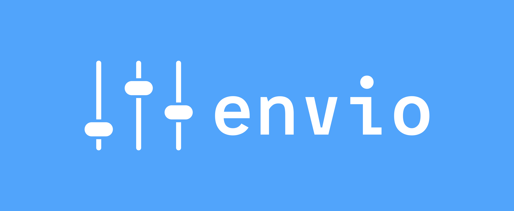
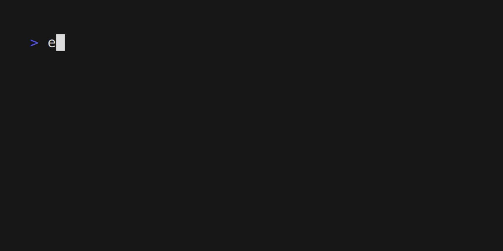

<link rel="stylesheet" href="https://unpkg.com/swiper/swiper-bundle.min.css" />
<script src="https://unpkg.com/swiper/swiper-bundle.min.js"></script>
<h1 align="center">

</h1>

<div align="center">
<h2 align="center">A Modern And Secure CLI Tool For Managing Environment Variables</h2>

[](https://github.com/humblepenguinn/envio/workflows/CICD.yml)
[](https://crates.io/crates/envio)

</div>

<p align="center">
  <a href="#about">About</a> •
  <a href="#profiles">Profiles</a> •
  <a href="#installation">Installation</a> •
  <a href="#usage">Usage</a> •
  <a href="#contributing">Contributing</a> •
  <a href="#license">License</a>
</p>

---

<div class="swiper-container" align="center">
  <div class="swiper-wrapper">
    <div class="swiper-slide"><p>Demo with passphrase encryption</p></div>
    <div class="swiper-slide"><p>Demo with gpg encryption</p></div>
  </div>
  <div class="swiper-pagination"></div>
</div>

<script>
  var mySwiper = new Swiper('.swiper-container', {
  pagination: {
    el: '.swiper-pagination',
    clickable: true
  }
});

</script>

## About

`envio` is an open source CLI tool that helps make managing environment variables a breeze. With `envio`, users can create encrypted profiles that contain a collection of environment variables associated with a specific project or use case. `envio` ensures security and simplifies the development process by allowing users to easily switch between profiles as needed and load them in their current terminal session for immediate use.

Some key features of `envio` include:
- `Encrypted` profiles through `GPG` or normal `passphrase` encryption
- Load profiles into your `terminal sessions`
- `Persistent` environment variables that are available in `future sessions`
- `Run` programs with your profiles
- `Importing` profiles from a file
- `Downloading` profiles and then importing them
- `Exporting` profiles to a file

## Profiles

In `envio`, a profile is a collection of environment variables that are associated with a specific project, application, or use case. Users can create multiple profiles, each with their own set of environment variables, and easily switch between them as needed.

For example, a developer might create a profile for a web development project that includes environment variables for the database connection, API keys, and other project-specific settings. They could then switch to a different profile for a mobile app project that requires a different set of environment variables.

The benefit of using profiles is that users can easily manage and switch between different sets of environment variables without having to manually set and unset them every time they switch tasks. Additionally, in `envio`, profiles are encrypted, so users can rest assured that their sensitive environment variables are secure and require a key to access them.

## Installation

You can install `envio` through a few methods

### Releases

You can head over to the [releases page](https://github.com/humblepenguinn/envio/releases/latest) and download the official `envio` binaries from there for your target operating system. `Windows MSI installers` are also available

### Cargo Repository

You can install `envio` through the Cargo repository using the following command:

```sh
$ cargo install envio
```

### Source

Go [here](./docs/build_from_source.md) to see how

More methods of installation will be added in the future!

## Usage

Go [here](./docs/usage.md) to see how to use the tool

## Development

In addition to the command-line tool, `envio` can also be used as a library in Rust programs to manage environment variables. To use `envio` in your program, add it as a dependency in your Cargo.toml file:

Please note that the envio library is not stable right now and can be subjected to many changes!

```rust
[dependencies]
envio = "0.1.0"
```

Then, in your Rust code, you can use the `envio` crate to read and write environment variables
Here's a simple example:

```rust
// In this example we get the profile passed as an argument to the program
// and then print the environment variables in that profile

use envio;

let args: Vec<String> = std::env::args().collect();

if args.len() != 2 {
  println!("Usage: <profile_name> <key>");
  return;
}

let profile_name = &args[1];
let key = &args[2]; // All profiles have a key that is used to encrypt the environment variables, this ensures that the environment variables are secure


for (env_var, value) in &envio::get_profile(profile_name.to_string(), key.to_string()).unwrap().envs {
  println!("{}: {}", env_var, value);
}

```

For more examples check out the [examples](./examples/) directory

Currently, `envio` is only available as a Rust library

## Contributors

<!-- ALL-CONTRIBUTORS-LIST:START - Do not remove or modify this section -->
<!-- prettier-ignore-start -->
<!-- markdownlint-disable -->
<table>
  <tbody>
    <tr>
      <td align="center" valign="top" width="14.28%"><a href="https://github.com/Vojtch159"><br /><sub><b>Vojtch</b></sub></a><br /><a href="https://github.com/humblepenguinn/envio/commits?author=Vojtch159" title="Documentation">📖</a></td>
      <td align="center" valign="top" width="14.28%"><a href="https://github.com/erjanmx"><br /><sub><b>Erjan Kalybek</b></sub></a><br /><a href="https://github.com/humblepenguinn/envio/commits?author=erjanmx" title="Documentation">📖</a></td>
    </tr>
  </tbody>
</table>

<!-- markdownlint-restore -->
<!-- prettier-ignore-end -->

<!-- ALL-CONTRIBUTORS-LIST:END -->
<!-- prettier-ignore-start -->
<!-- markdownlint-disable -->

<!-- markdownlint-restore -->
<!-- prettier-ignore-end -->

<!-- ALL-CONTRIBUTORS-LIST:END -->

## Contributing

Contributions to `envio` are always welcome! Please see the [Contributing Guidelines](CONTRIBUTING.md) for more information.

## License

This project is licensed under the [MIT](LICENSE-MIT) License and the [Apache](LICENSE-APACHE) License
